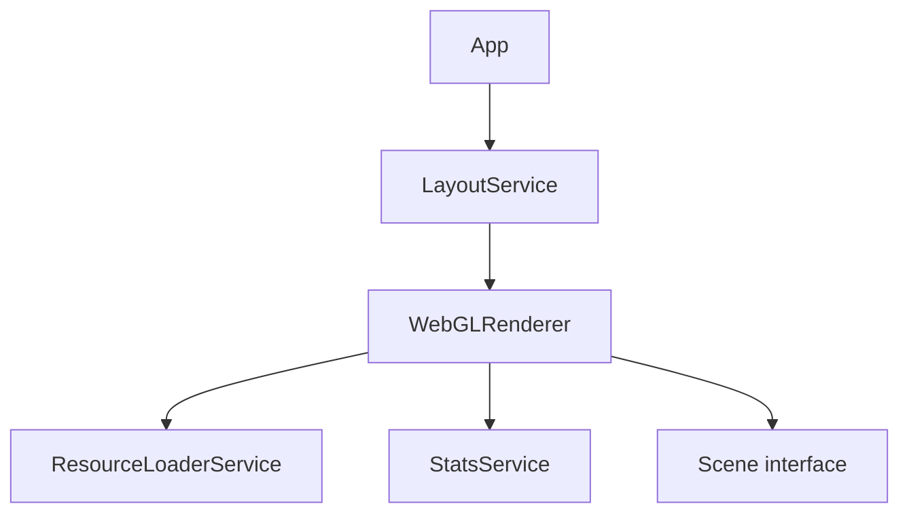

# Client Architecture

```mermaid
flowchart TD
    App["App"] --> LayoutService["LayoutService"]
    LayoutService --> WebGLRenderer["WebGLRenderer"]
    WebGLRenderer --> ResourceLoaderService["ResourceLoaderService"]
    WebGLRenderer --> StatsService["StatsService"]
    WebGLRenderer --> Scene["Scene interface"]
```
