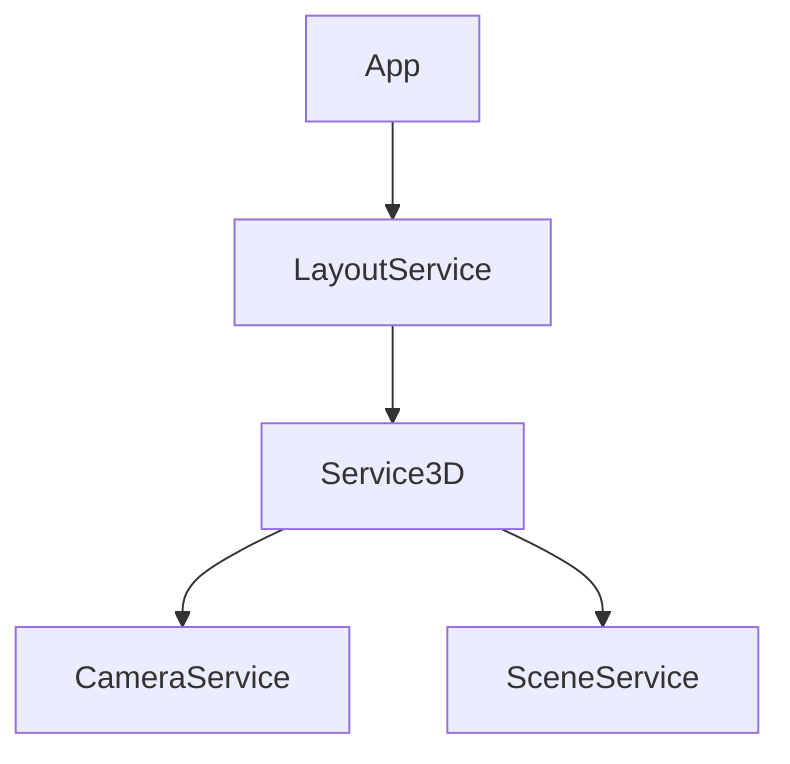

# Client Architecture

```mermaid
flowchart TD
    App["App"] --> LayoutService["LayoutService"]
    LayoutService --> Service3D["Service3D"]
    Service3D --> CameraService["CameraService"]
    Service3D --> SceneService["SceneService"]
```
