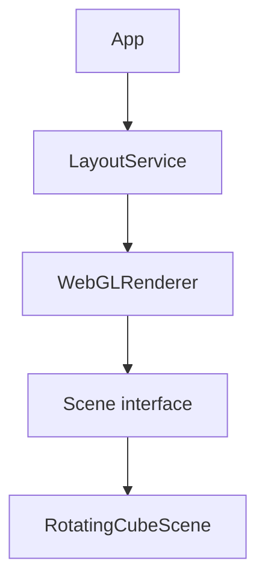

# Client Architecture

```mermaid
flowchart TD
    App["App"] --> LayoutService["LayoutService"]
    LayoutService --> WebGLRenderer["WebGLRenderer"]
    WebGLRenderer --> Scene["Scene interface"]
    Scene --> RotatingCubeScene["RotatingCubeScene"]
```
