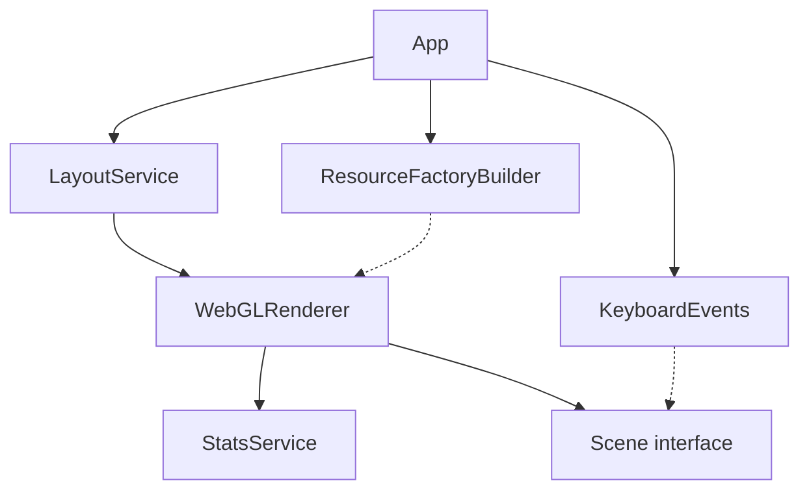
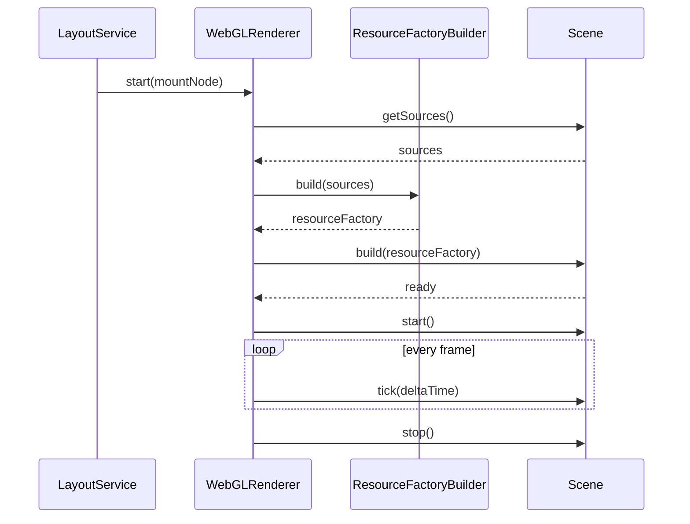

# Client Architecture

```mermaid
flowchart TD
    App["App"] --> LayoutService["LayoutService"]
    App --> KeyboardEvents["KeyboardEvents"]
    App --> ResourceFactoryBuilder["ResourceFactoryBuilder"]
    LayoutService --> WebGLRenderer["WebGLRenderer"]
    WebGLRenderer --> StatsService["StatsService"]
    WebGLRenderer --> Scene["Scene interface"]
    KeyboardEvents -.-> Scene
    ResourceFactoryBuilder -.-> WebGLRenderer
```

```mermaid
sequenceDiagram
    participant LayoutService
    participant WebGLRenderer
    participant ResourceFactoryBuilder
    participant Scene

    LayoutService->>WebGLRenderer: start(mountNode)
    WebGLRenderer->>Scene: getSources()
    Scene-->>WebGLRenderer: sources
    WebGLRenderer->>ResourceFactoryBuilder: build(sources)
    ResourceFactoryBuilder-->>WebGLRenderer: resourceFactory
    WebGLRenderer->>Scene: build(resourceFactory)
    Scene-->>WebGLRenderer: ready
    WebGLRenderer->>Scene: start()
    loop every frame
        WebGLRenderer->>Scene: tick(deltaTime)
    end
    WebGLRenderer->>Scene: stop()
```
