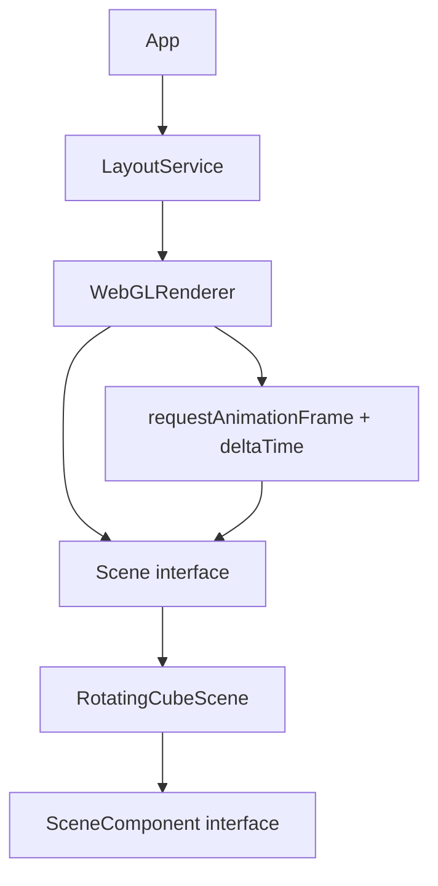

# Client Architecture

```mermaid
flowchart TD
    App["App"] --> LayoutService["LayoutService"]
    LayoutService --> WebGLRenderer["WebGLRenderer"]
    WebGLRenderer --> Scene["Scene interface"]
    WebGLRenderer --> TickLoop["requestAnimationFrame + deltaTime"]
    TickLoop --> Scene
    Scene --> RotatingCubeScene["RotatingCubeScene"]
    RotatingCubeScene --> SceneComponent["SceneComponent interface"]
```
