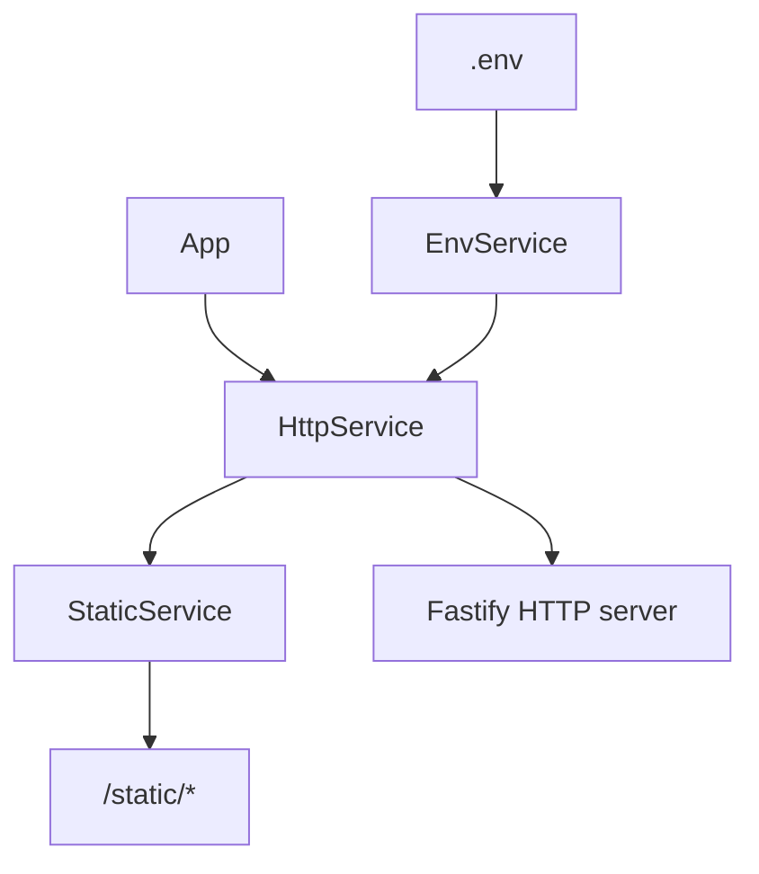

# Server Architecture

```mermaid
flowchart TD
    EnvFile[".env"] --> EnvService["EnvService"]
    App["App"] --> HttpService["HttpService"]
    EnvService --> HttpService
    HttpService --> StaticService["StaticService"]
    HttpService --> HttpOutput["Fastify HTTP server"]
    StaticService --> StaticDir["/static/*"]
```
